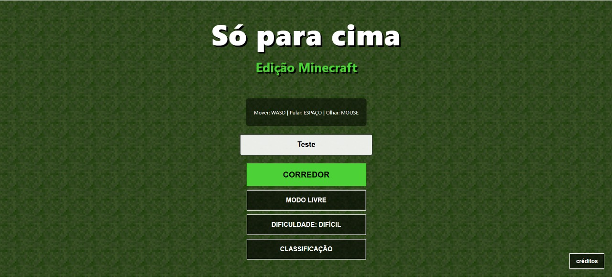
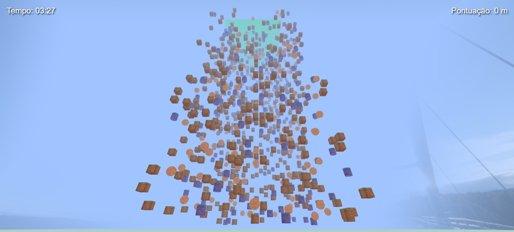

# OnlyUp Edição Minecraft

## Objetivo do Projeto
Este projeto é uma recriação web do popular jogo de plataforma vertical "OnlyUp", com uma temática visual totalmente inspirada em **Minecraft**.

O objetivo é simples, mas desafiador: controlar o personagem e subir o mais alto possível pulando entre blocos flutuantes gerados proceduralmente. O jogador deve ter precisão e agilidade para não cair e reiniciar o progresso!

## Demonstração

<div align="center">
  
  
</div>

## Controles
Baseado na interface do jogo:

* **[ W, A, S, D ]**: Mover o personagem.
* **[ ESPAÇO ]**: Pular.
* **[ MOUSE ]**: Olhar / Controlar a câmera.

## Funcionalidades
Além da mecânica principal de pulo, o jogo conta com:
* **Modos de Jogo:** Opção de "Corredor" (Time Attack) ou "Modo Livre".
* **Seletor de Dificuldade:** Ajuste do desafio (ex: modo Difícil).
* **Sistema de Classificação:** Ranking para salvar as melhores pontuações.
* **Temática Minecraft:** Texturas de blocos (terra, madeira, ametista) e skybox característico.

## Tecnologias Usadas
* **HTML5:** Estrutura do jogo.
* **CSS3:** Estilização e interface do usuário (UI).
* **JavaScript (ES6+):** Lógica completa (física, movimentação, loop do jogo).
* **Vite:** Ferramenta de build e servidor de desenvolvimento.
* **NPM:** Gerenciamento de pacotes.

## Principais Desafios

* **Lógica de Geração Procedural:** Criar um algoritmo que gera os blocos infinitamente para cima sem que eles se sobreponham (overlap), garantindo que sempre exista um caminho possível para o jogador subir.
* **Física e Colisões:** Ajustar a gravidade e a detecção de colisão (hitbox) para que o personagem pouse precisamente nas texturas dos blocos sem atravessá-los.
* **Gerenciamento de Áudio:** Sincronizar os efeitos sonoros (como o som de "tempo esgotando") com a lógica do jogo usando JavaScript.
* **Configuração do Ambiente:** Configurar o Vite corretamente para gerenciar os assets (imagens e sons) e otimizar o build do projeto.

## Instruções de Instalação e Execução

Para rodar o projeto na sua máquina:

1. **Clone o repositório:**
   ```bash
   git clone [https://github.com/ThaigoDev/OnlyUp.git](https://github.com/ThaigoDev/OnlyUp.git)